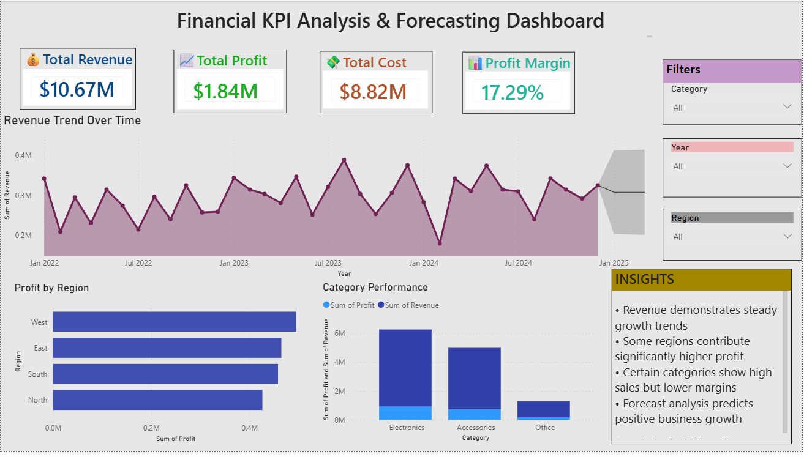

# Financial KPI Analysis & Forecasting using Excel and Power BI

## Project Overview
Developed an interactive financial analytics dashboard to analyze revenue, profit, cost trends, and business performance using Excel and Power BI.

## Business Problem
Organizations require financial insights to monitor profitability, identify cost patterns, and forecast future business performance for strategic decision-making.

## Tools & Technologies
- Power BI
- Advanced Excel
- Data Analysis
- Forecasting Techniques
- KPI Reporting

## Key KPIs
- Total Revenue
- Total Profit
- Profit Margin
- Total Cost
- Monthly Growth Trends

## Dashboard Features
- KPI Cards
- Revenue & Profit Trend Analysis
- Forecasting Visualization
- Monthly Performance Tracking
- Interactive Filters & Slicers

## Key Insights
- Revenue showed steady monthly growth
- Profit margins improved during high-sales periods
- Forecasting identified future business growth opportunities
- Cost analysis highlighted operational improvement areas

## Business Recommendations
- Optimize operational expenses
- Focus on high-performing sales periods
- Use forecasting insights for budgeting and planning
- Improve profit margins through cost control strategies

## Project Outcome
Provided data-driven financial insights through dashboards and forecasting models to support business decision-making and performance analysis.

## Dashboard Preview

